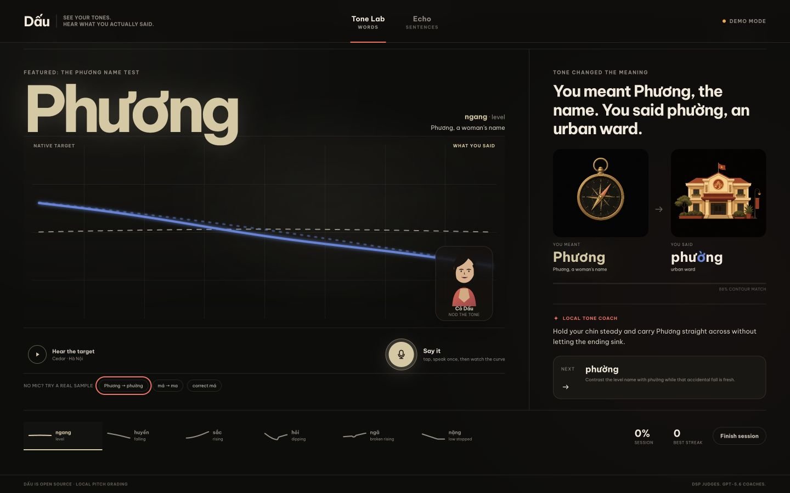

# Dấu

> See your tones. Hear what you actually said.

Dấu is an open-source practice lab that makes Vietnamese tones visible by drawing a learner's pitch over a DSP-validated reference target. Deterministic signal processing grades the contour, then a tone coach explains the physical correction and shows the real meaning a wrong tone can create.

**Demo video:** [Build Week submission video coming soon](https://github.com/roberthuynh/dau-tones)



## Quick start

```bash
git clone https://github.com/roberthuynh/dau-tones.git
cd dau-tones
./dev.sh
```

Wait for `READY http://localhost:5173`, then open that URL. The script installs an uv-managed Python 3.11 environment and locked npm dependencies, warms pYIN, and starts FastAPI on port 8000 plus Vite on port 5173. Node.js 22+ and either `uv` or `curl` are the only host requirements.

No microphone is needed for the judging loop. In Tone Lab, use the three **No mic? Try a real sample** buttons for correct `má`, `má` flattened into `ma`, and the signature `Phương` to `phường` mistake. In Echo, run **Try “a ghost at dinner”**, then compare the committed learner sentence with Cô Linh's committed correction.

**Cold-start receipt, 2026-07-18:** a fresh clone on macOS with `OPENAI_API_KEY` unset printed `READY` in about 56 seconds. The check loaded all 19 words, replayed the Phương sample through `/api/analyze`, returned the ghost-at-dinner tone diff, and streamed committed Echo speech.

No OpenAI key is required for local grading, target playback, committed meaning art, deterministic coaching, analyzer demos, or cached Echo shadowing. With a key, server-only AI coaching and live Echo features turn on automatically:

```bash
cp .env.example .env.local
# Put OPENAI_API_KEY in .env.local. Never expose it through a VITE_ variable.
./dev.sh
```

The same monorepo is live at [dau.huynhrobert.com](https://dau.huynhrobert.com) as one Vercel project: the Vite service owns `/`, the FastAPI service owns `/api`, and the secret remains scoped to the Python service. The native pYIN, SciPy, LLVM, and PyAV stack uses [Vercel Large Functions](https://vercel.com/changelog/python-vercel-functions-bundle-size-limit-increased-to-500mb); the deployed function keeps the same DSP and browser-audio decoding in production.

GitHub Actions is manual-only during the build to preserve the free-plan quota. The same lint, test, build, and offline end-to-end checks run locally before each published milestone.

## How it works

1. `gpt-realtime-2.1` speaks five Cô Linh reference candidates for every target in Northern and Southern Vietnamese, using the provider voice ID `cedar`. The same DSP used for learners rejects acoustically invalid candidates before one take can become ground truth.
2. `librosa.pyin` extracts F0, fills valid unvoiced gaps, normalizes pitch into speaker-relative semitones, and resamples each contour to 64 points. The browser starts an idempotent pitch-engine warmup while the learner reads and listens; the deterministic template matcher then grades shape, timing, energy, and voicing evidence without waiting for coaching.
3. `gpt-5.6-sol` runs only on the FastAPI server for specific coaching, next-drill selection with visible reasoning, themed ordering of committed inventory words, and Echo meaning explanations. Rule-based coaching covers the same loop when no key is present.
4. `gpt-4o-transcribe` runs server-side for keyed Echo transcription. `gpt-realtime-2.1-mini` generates bounded Echo shadowing speech. Available validated drill playback uses committed reference audio and is never synthesized during practice.
5. `gpt-image-2` generates the committed word illustrations at build time and one optional literal wrong-sentence reveal at runtime. The browser never receives an OpenAI key.

Audio language models are poor judges of pitch shape, so the DSP judges and the LLM coaches. Pitch grading is deterministic and inspectable; GPT-5.6 handles the work it is better at: concrete instruction, drill choice, and meaning. The committed Stage 6 harness will measure this claim after the four phone fallbacks complete the corpus by asking the sibling Realtime model to name the tones in its own accepted speech and comparing it with the leakage-safe DSP evaluation.

Echo's optional wrong-sentence picture is requested after the text diff appears, returned in the same server invocation, and cached in the browser by a versioned prompt hash so Vercel instance changes cannot strand a polling request or rebill the same reveal in that browser. **Roadmap:** a live Vietnamese conversation mode can build on these single-utterance pieces after Build Week; it is intentionally not a build-day feature.

Stage 0 is deliberately an all-or-nothing gate. Cô Linh's reference voice produced five isolated takes and up to five carrier-phrase takes per word and accent; `gpt-4o-transcribe` checked lexical identity, then the shared DSP checked signal quality and the expected contour. Manifests retain `cedar` as the provider's machine-readable voice ID. The current receipt accepts 34 of 38 pairs and withholds `targets/manifest.json` until phone recordings replace four exhausted pairs: Northern `mả`, Northern `phở`, Southern `mả`, and Southern `phượng`. The accepted partial receipt can power templates and no-mic demos, but health continues to report the corpus as incomplete and no failed take is shipped as ground truth. The phone fallback importer normalizes each recording to mono PCM WAV, reruns both lexical and DSP checks, audits all 38 hashes, and writes the report and manifest as one rollback-safe transaction.

Active model IDs live in one API config module:

| Job | Model |
| --- | --- |
| Coaching, drills, explanations | `gpt-5.6-sol` |
| Meaning and Echo reveal art | `gpt-image-2` |
| Echo transcription | `gpt-4o-transcribe` |
| Echo speech | `gpt-realtime-2.1-mini` |
| Reference targets and benchmark | `gpt-realtime-2.1` |

## Built with Codex

This task is the build log and scored Codex artifact. The repository is pushed as verified stages land so the history records the product being made, not a final code dump.

| Stage | What Codex accelerated | Key decision and owner |
| --- | --- | --- |
| Repository | Product plan, safety boundaries, offline contract, and incremental publishing | Robert required MIT in commit 1 and direct pushes to `main`; Codex set the verification gates. |
| Cold start | Locked Python/Node installs, pYIN warming, dual-process supervision, manual CI, and a one-project Vercel service map | Robert added Vercel deployment; Codex kept local and hosted URLs on the same `/api` contract and preserved the full DSP stack with Large Functions. |
| Voice design | Dual-accent target generation and DSP acceptance design | Robert chose the provider voice and supplied the exact Sài Gòn and Hà Nội prompts; Dấu presents the teacher as Cô Linh. |
| Grading | Accent-conditioned acoustic families and honest uncertainty | Robert required six visible tones; Codex recommended Northern evaluation-gated six-way grading and Southern four-family auto-verification. |
| DSP engine | Browser-media decoding, speech-island checks, pYIN, speaker-relative contours, constrained DTW, feature distance, confidence, abstention, and grouped-fold evaluation | Codex made intended tone unavailable to detection and capped confidence at 0.95; Robert chose the dual-accent product behavior. |
| API | Typed analysis, fallback and GPT coaching, committed-inventory drill selection, NFC Echo alignment, cached speech, capability flags, and human error responses | Codex kept every AI client lazy and server-only; Robert required the complete loop to survive with no key. |
| Meaning art | Nineteen cached `gpt-image-2` illustrations, locked prompts, hashes, and a contact-sheet audit | Robert made wrong-meaning pictures load-bearing; Codex kept generation build-time, one-shot, and fully available offline. |
| Tone Lab | Canvas contour choreography, microphone silence-stop, meaning verdicts, session summaries, responsive layouts, and the code-native Cô Dấu coach | Robert specified the dark theatre and signature Phương moment; Codex implemented and browser-tested the full loop at desktop and mobile sizes. |
| First-use redesign | A 96px coral recording action, readable type scale, three-step practice hierarchy, dedicated Cô Dấu teaching rail, larger mouth cues, and focused mobile order | Robert flagged the first screen as too small; Codex treated recording and physical imitation as the two primary actions across Tone Lab and Echo. |
| Pitch latency | Cold/warm profiling, proactive single-flight pYIN warmup, lazy media/model imports, PCM WAV fast path, async DSP execution, and `Server-Timing` receipts | Robert reported a long “Reading your pitch” wait; Codex measured the cold compiler cost, preserved the validated pYIN parameters, and detached optional coaching from the verdict path. |
| Target audit | Five Cô Linh reference takes per word/accent, carrier retries, lexical checks, DSP receipts, hash validation, a hard manifest gate, and a transactional phone importer | Codex found and fixed a double voicing rejection in the pYIN pipeline, then stopped at 34/38 instead of weakening four failed gates. Robert will supply the four phone fallbacks. |
| Echo speech | Sixteen cached shadowing utterances with exact ASR and contour-presence receipts | Robert required Realtime mini as the active model; Codex kept 12 mini takes and stepped up only four `phở`/`nước` utterances whose mini takes failed exact lexical validation. |
| Offline demos | Three analyzer WAVs and one wrong-sentence Echo WAV, all hash-stamped and committed | Codex replayed the real samples through the analyzer and added the no-key Phương verdict and ghost-at-dinner path. |
| Acceptance audit | Typed API contracts, history-aware fallback coaching, direct Echo art delivery, hero meaning art, vowel-aware Cô Dấu poses, and a network-blocked Playwright loop | Codex found the contract drift and serverless polling race, then made one offline browser test close the signature verdict, next-drill reasoning, Echo diff, cached speech, keyboard, reduced-motion, and PNG-summary paths. |
| Evaluation receipt | Fold-partition tests, WAV/hash verification, cache invalidation, atomic benchmark progress, and a receipt-matched DSP/Realtime comparison | Robert required an in-repo proof instead of a claim; Codex bound both evaluators to the same manifest and audio hashes and still withheld every metric until the four phone fallbacks pass. |

Estimated build-time OpenAI spend recorded in the ignored ledger is **$11.53**, below the $45 hard stop. Nineteen meaning images account for $0.95; the remaining spend covers target generation, lexical validation, and Echo speech.

## Evaluation

All reported product metrics will come from committed artifacts generated by `python -m api.eval`. They will be labeled **synthetic-reference leave-one-out evaluation**, not learner-population accuracy.

Run the receipt after the validated target corpus is present:

```bash
uv run --project api python -m api.eval
```

The evaluator fits scales, confidence temperature, and abstention inside grouped leave-one-word-out folds. Northern six-way grading turns on only when accuracy is at least 0.80, macro recall at least 0.75, every-tone recall at least 0.60, hỏi/ngã mutual confusion at most 0.20, and every tone has at least three held-out words. Southern remains four-family scoring while all six curves stay visible.

### Confusion matrix

Pending the four phone fallbacks listed above and the resulting complete manifest. No synthetic or hand-entered score is presented as a result.

### DSP versus audio-model benchmark

| Evaluator | Exact-tone accuracy | Acoustic-family accuracy | Receipt |
| --- | ---: | ---: | --- |
| DSP template classifier | Pending | Pending | `api/data/evaluation.json` |
| `gpt-realtime-2.1` audio benchmark | Pending | Pending | `api/data/benchmark_llm.json` |

## License

Dấu is released under the [MIT License](LICENSE). Be Vietnam Pro is self-hosted under its SIL Open Font License, included beside the font files.
