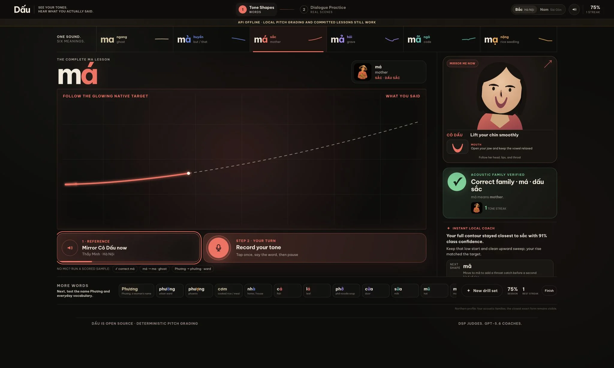
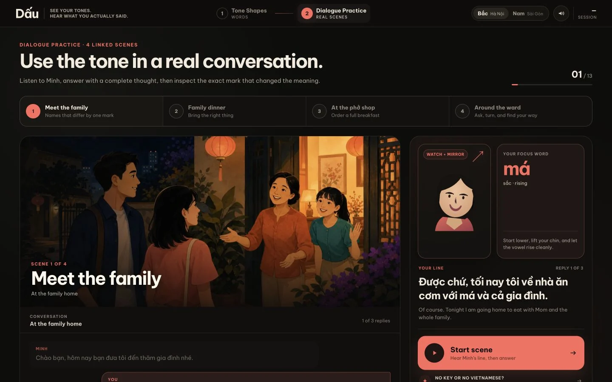
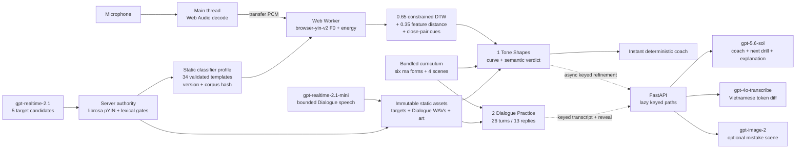
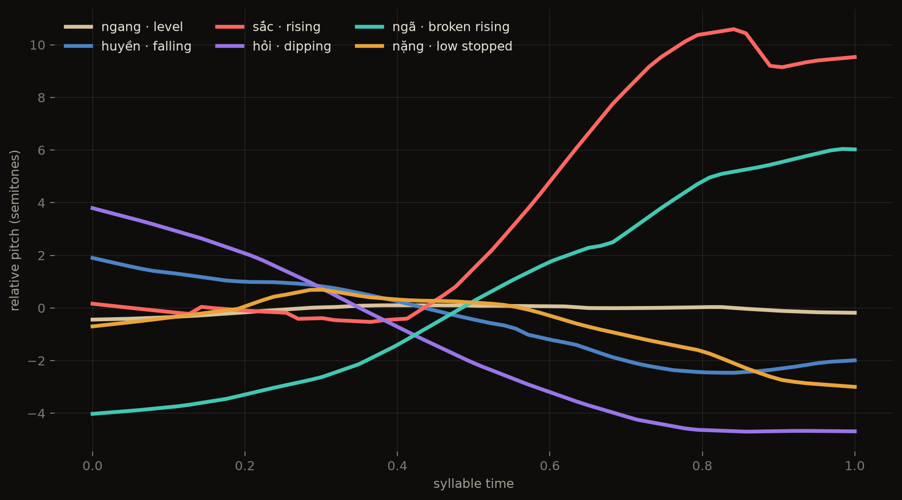

# Dấu

> See your tones. Hear what you actually said.

Dấu is an open-source practice lab that makes Vietnamese tones visible by drawing a learner's pitch over a DSP-validated reference target. It opens with the six meanings of `ma`, carries those tone shapes into connected dialogues, and uses deterministic signal processing to grade while a coach explains the physical correction and the meaning a wrong mark can create.

**Demo video:** [Build Week submission video coming soon](https://github.com/roberthuynh/dau-tones)





## Quick start

```bash
git clone https://github.com/roberthuynh/dau-tones.git
cd dau-tones
./dev.sh
```

Wait for `READY http://localhost:5173`, then open that URL. The script installs an uv-managed Python 3.11 environment and locked npm dependencies, warms the corpus-validation pYIN runtime, and starts FastAPI on port 8000 plus Vite on port 5173. Node.js 22+ and either `uv` or `curl` are the only host requirements.

Start in **1 Tone Shapes**. The top rail puts `ma`, `mà`, `má`, `mả`, `mã`, and `mạ` in one lesson; select a meaning, listen to Thầy Minh, mirror Cô Dấu, then record one clear syllable. Phương, phường, and phượng follow under **More words**. No microphone is needed for the analyzer receipt: the committed sample controls cover correct `má`, `má` flattened into `ma`, and the signature `Phương` to `phường` mistake.

Continue to **2 Dialogue Practice** for four linked scenes: **Meet the family**, **Family dinner**, **At the phở shop**, and **Around the ward**. The course contains 26 alternating turns and 13 substantial learner replies, preserves the scene, turn, and focus word in the URL, and links each changed token back to Tone Shapes. All 52 Northern and Southern scene WAVs passed lexical and signal checks, all seven story illustrations are committed, and one wrong-tone replay per scene closes the no-key feedback loop.

**Cold-start receipt, 2026-07-19, commit `070ad2e`:** a fresh public clone on Apple Silicon macOS with `OPENAI_API_KEY` explicitly unset printed `READY` in 88 seconds after installing its own Python 3.11.15 runtime and locked dependencies. The check loaded all 19 words and six `ma` forms, returned four scenes with 26 turns, streamed a validated target plus a Dialogue WAV, and passed the full offline Tone Shapes and Dialogue Practice Playwright flow at all six release viewports.

No OpenAI key is required for browser grading, available validated target playback, committed word and scene art, deterministic coaching, analyzer demos, all 52 correct dialogue utterances, learner replay, or the four committed wrong-tone scene fixtures. With a key, server-only AI coaching and live Dialogue transcription, explanations, and optional mistake art turn on automatically:

```bash
cp .env.example .env.local
# Put OPENAI_API_KEY in .env.local. Never expose it through a VITE_ variable.
./dev.sh
```

The same monorepo is live at [dau.huynhrobert.com](https://dau.huynhrobert.com) as one Vercel project: Vite owns `/`, FastAPI owns `/api`, and the OpenAI secret remains scoped to Python. Live learner pitch grading stays in a browser Worker. Validated target and Dialogue WAVs are copied to `web/public/audio/` and served with immutable static URLs, so practice playback never waits for a Python function. The native pYIN, SciPy, LLVM, and PyAV stack remains server-side for corpus validation, evaluation, and compatibility analyzer receipts, using [Vercel Large Functions](https://vercel.com/changelog/python-vercel-functions-bundle-size-limit-increased-to-500mb).

GitHub Actions is manual-only during the build to preserve the free-plan quota. The same lint, test, build, and offline end-to-end checks run locally before each published milestone.

## How it works

### Production architecture



The latency boundary is deliberate. The main thread decodes the recording, transfers PCM to a Web Worker, and stays free to animate the interface while the Worker extracts pitch and grades. The verdict, first coaching instruction, and next-practice reason require no network request. FastAPI lazy-imports OpenAI and the heavy Python analysis stack only for keyed or compatibility routes. `/api/analyze` remains available for reproducible receipts, but it is not on the live microphone path.

1. `gpt-realtime-2.1` speaks five Thầy Minh reference candidates for every word in Northern and Southern Vietnamese. The product calls the male reference teacher **Thầy Minh**; the provider voice ID stays only in generation receipts. `gpt-4o-transcribe` checks lexical identity, then the server DSP rejects acoustically invalid candidates before one take can become ground truth.
2. `librosa.pyin` extracts authoritative reference and evaluation F0, preserves voicing and RMS evidence, fills valid gaps, converts pitch to speaker-relative semitones, and resamples to 64 points. The production browser path removes octave spikes and computes the same contour and feature contract in a Worker.
3. The browser classifier ranks accent-conditioned templates with `0.65 × constrained DTW + 0.35 × robust feature distance`. A `0.20` energy and voicing cue only breaks close hỏi/ngã, sắc/ngã, and huyền/nặng cases. Signal confidence and class confidence are separate; weak audio or a weak margin abstains instead of asserting an accidental meaning.
4. `gpt-5.6-sol` runs only on FastAPI for structured coaching, next-drill selection, and Dialogue meaning explanations. The deterministic coach returns `observation`, one physical correction, `next_word`, and `rationale` immediately; GPT refinement can replace it asynchronously without delaying the verdict.
5. `gpt-4o-transcribe` runs server-side for keyed Dialogue transcription. `gpt-realtime-2.1-mini` generates one bounded Thầy Minh or learner-model utterance per scene turn, and `gpt-image-2` generates committed story art plus optional live mistake art. Static generation is build-time; the browser never receives an OpenAI key.

Cô Dấu is the visual teacher, not the reference voice. In Tone Shapes she occupies the right teaching rail with a large face, lips, mouth close-up, throat cue, and contour-driven chin motion. In Dialogue Practice she follows the current focus word rather than guessing one tone for an entire sentence. Thầy Minh supplies the male reference speech and the partner lines.

The semantic layer is independent from the acoustic score. It emits six explicit states: `exact_correct`, `family_correct`, `family_ambiguous`, `wrong_known_word`, `wrong_no_known_word`, and `uncertain`. Only a supported exact or family assertion may name an accidental meaning. A same-family ambiguity is amber; low signal or a weak class margin asks for another take.

Audio language models are poor judges of pitch shape, so the DSP judges and the LLM coaches. Pitch grading is deterministic and inspectable; GPT-5.6 handles concrete instruction, drill choice, and meaning. The committed Stage 6 harness will measure the audio-model comparison after the four phone fallbacks complete the corpus by asking the sibling Realtime model to name tones in its own accepted speech and comparing it with grouped DSP evaluation.

Dialogue Practice is a course, not a live conversation session. Partner lines start only after an explicit user gesture, each learner reply receives an NFC-aware token diff, and changed words link back to Tone Shapes. Its four scenes are **Meet the family**, **Family dinner**, **At the phở shop**, and **Around the ward**. Optional wrong-scene art appears after the text diff and is keyed by a versioned prompt hash. **Roadmap:** a live Vietnamese conversation mode can build on these single-utterance pieces later.

Stage 0 is deliberately an all-or-nothing gate. Thầy Minh produced five isolated takes and up to five carrier-phrase takes per word and accent; `gpt-4o-transcribe` checked lexical identity, then the shared DSP checked signal quality and expected contour. The current receipt accepts 34 of 38 pairs and withholds `targets/manifest.json` until four phone recordings replace exhausted pairs: Northern `mả`, Northern `phở`, Southern `mả`, and Southern `phượng`. No failed take is shipped as ground truth. The transactional importer normalizes a phone recording to mono PCM WAV, reruns lexical and DSP checks, audits all 38 hashes, then writes the report and manifest together.

The static browser profile is `dau-browser-dsp-2.0.0`, bound to partial-corpus SHA-256 `ae637c5a737d3dac9e6e400a98b411ef48db573c1a3ee2b43e717d8fabd13563`. It is explicitly marked `corpus_complete: false`; both accents therefore stay in four-family mode until the four imports pass and the evaluation gates promote Northern six-tone grading.



Active model IDs live in one API config module:

| Job | Model |
| --- | --- |
| Coaching, drills, explanations | `gpt-5.6-sol` |
| Meaning and Echo reveal art | `gpt-image-2` |
| Echo transcription | `gpt-4o-transcribe` |
| Echo speech | `gpt-realtime-2.1-mini` |
| Reference targets and benchmark | `gpt-realtime-2.1` |

## Built with Codex

This task is the build log and scored Codex artifact. The repository is pushed as verified stages land so the history records the product being made, not a final code dump.

| Stage | What Codex accelerated | Key decision and owner |
| --- | --- | --- |
| Repository | Product plan, safety boundaries, offline contract, and incremental publishing | Robert required MIT in commit 1 and direct pushes to `main`; Codex set the verification gates. |
| Cold start | Locked Python/Node installs, pYIN warming, dual-process supervision, manual CI, and a one-project Vercel service map | Robert added Vercel deployment; Codex kept local and hosted URLs on the same `/api` contract and preserved the full DSP stack with Large Functions. |
| Voice design | Dual-accent target generation and DSP acceptance design | Robert chose the provider voice and supplied the exact Sài Gòn and Hà Nội prompts; Dấu presents the male reference teacher as Thầy Minh. |
| Grading | Accent-conditioned acoustic families and honest uncertainty | Robert required six visible tones; Codex recommended Northern evaluation-gated six-way grading and Southern four-family auto-verification. |
| DSP engine | Browser-media decoding, speech-island checks, pYIN, speaker-relative contours, constrained DTW, feature distance, confidence, abstention, and grouped-fold evaluation | Codex made intended tone unavailable to detection and capped confidence at 0.95; Robert chose the dual-accent product behavior. |
| API | Typed analysis, fallback and GPT coaching, committed-inventory drill selection, NFC Echo alignment, cached speech, capability flags, and human error responses | Codex kept every AI client lazy and server-only; Robert required the complete loop to survive with no key. |
| Meaning art | Nineteen cached `gpt-image-2` illustrations, locked prompts, hashes, and a contact-sheet audit | Robert made wrong-meaning pictures load-bearing; Codex kept generation build-time, one-shot, and fully available offline. |
| Tone Lab | Canvas contour choreography, microphone silence-stop, meaning verdicts, session summaries, responsive layouts, and the code-native Cô Dấu coach | Robert specified the dark theatre and signature Phương moment; Codex implemented and browser-tested the full loop at desktop and mobile sizes. |
| First-use redesign | A 96px coral recording action, readable type scale, three-step practice hierarchy, dedicated Cô Dấu teaching rail, larger mouth cues, and focused mobile order | Robert flagged the first screen as too small; Codex treated recording and physical imitation as the two primary actions across Tone Lab and Echo. |
| Pitch latency | Cold/warm profiling, browser-local Web Audio decoding and autocorrelation grading, bounded processing, and server timing receipts | Robert reported a long “Reading your pitch” wait; Codex traced it to the hosted Python cold start, kept pYIN authoritative for references/evaluation, and removed that server round trip from the learner verdict. |
| Target audit | Five Thầy Minh reference takes per word/accent, carrier retries, lexical checks, DSP receipts, hash validation, a hard manifest gate, and a transactional phone importer | Codex found and fixed a double voicing rejection in the pYIN pipeline, then stopped at 34/38 instead of weakening four failed gates. Robert will supply the four phone fallbacks. |
| Six-tone lesson | A `ma`-first top rail, shared journey header, above-the-fold workbench, larger Cô Dấu teaching rail, explicit semantic verdicts, feedback sounds, and Tone Shapes to Dialogue links | Robert made all six `ma` forms the default and prioritized unmistakable right/wrong feedback; Codex translated that into the desktop hierarchy and assertion-safe state model. |
| Browser classifier | Transferable PCM analysis in a Web Worker, browser YIN v2, octave repair, DTW and feature ranking, close-pair cues, top-three alternatives, abstention, and a hash-bound static profile | Robert required classifier correctness before stronger verdicts; Codex replaced the threshold rules and separated signal quality from class confidence. |
| Dialogue course | Four linked scenes, 26 alternating turns, 13 learner replies, focus-word contours, URL state, token-to-Tone-Shapes links, and one offline semantic fixture per scene | Robert wrote the story arc and required useful learner-length lines; Codex encoded the schema, API compatibility aliases, validators, and linked interface. |
| Dialogue media | 52 dual-accent WAVs, exact-token ASR and signal validation, seven recurring-character scene images, a contact sheet, hashes, and immutable static routing | Robert chose Thầy Minh and the three literal-mistake reveals; Codex promoted only media that passed the recorded validation gates. Forty utterances use Realtime mini and twelve difficult lines use the full Realtime model. |
| Echo speech prototype | Sixteen cached shadowing utterances with exact ASR and contour-presence receipts | Robert required Realtime mini as the active model; Codex kept 12 mini takes and stepped up only four `phở`/`nước` utterances whose mini takes failed exact lexical validation. This receipt predates the 52-file Dialogue course. |
| Offline demos | Three analyzer WAVs and one wrong-tone replay for every Dialogue scene, all hash-stamped and committed | Codex used validated Realtime speech where it passed and sample-accurate, DSP-verified pitch transformations for the two cases that could not be elicited reliably. |
| Acceptance audit | Typed API contracts, history-aware fallback coaching, direct Echo art delivery, hero meaning art, vowel-aware Cô Dấu poses, and a network-blocked Playwright loop | Codex found the contract drift and serverless polling race, then made one offline browser test close the signature verdict, next-drill reasoning, Echo diff, cached speech, keyboard, reduced-motion, and PNG-summary paths. |
| Release proof | A public fresh clone, no-key one-command launch, static target and Dialogue playback, six responsive viewports, keyed coaching, and keyed transcription | Codex measured `READY` at 88 seconds and reran the complete offline journey from commit `070ad2e`; Robert keeps final corpus promotion gated on four real phone recordings. |
| Evaluation receipt | Fold-partition tests, WAV/hash verification, cache invalidation, atomic benchmark progress, and a receipt-matched DSP/Realtime comparison | Robert required an in-repo proof instead of a claim; Codex bound both evaluators to the same manifest and audio hashes and still withheld every metric until the four phone fallbacks pass. |

Estimated build-time OpenAI spend recorded in the ignored ledger is **$15.07**, below the $45 hard stop. The additional four-scene course, including 52 validated utterances, retries, lexical checks, and seven generated images, added about **$3.54** to the earlier $11.53 receipt.

## Evaluation

The browser-profile receipt below is a **synthetic-reference regression**, not learner-population accuracy. It uses only the 34 accepted generated references and remains provisional while the corpus is incomplete. Final product metrics still come from committed artifacts generated by `python -m api.eval` after the four phone fallbacks pass.

Run the receipt after the validated target corpus is present:

```bash
PYTHONPATH=api api/.venv/bin/python -m api.eval
```

The final evaluator fits scales, confidence temperature, and abstention inside grouped leave-one-word-out folds. Northern six-way grading turns on only when accuracy is at least 0.80, macro recall at least 0.75, every-tone recall at least 0.60, hỏi/ngã mutual confusion at most 0.20, and every tone has at least three held-out words. Southern remains four-family scoring while all six forms and curves stay visible.

### Current browser-classifier receipt

| Check | Result | Interpretation |
| --- | ---: | --- |
| Top-1 on committed references | 34 / 34 | Every accepted WAV ranks its own tone first when its template is present. This is a regression check, not held-out accuracy. |
| Asserted after abstention | 32 / 34 | Two weak-margin references abstain instead of forcing a meaning claim. |
| Grouped held-out exact tone | 23 / 33 (69.7%) | The held-out word is removed from its template set. One fold is unavailable because the partial corpus would remove the only example of a tone. |
| Grouped held-out acoustic family | 30 / 33 (90.9%) | Family scoring is the honest current product mode. |

### Confusion matrix

Provisional grouped held-out exact-tone matrix over the 34 accepted synthetic references. Rows are intended tones; columns are top-1 detected tones. One unavailable fold is excluded.

| Intended ↓ / Detected → | ngang | huyền | sắc | hỏi | ngã | nặng |
| --- | ---: | ---: | ---: | ---: | ---: | ---: |
| ngang | 6 | 0 | 0 | 0 | 0 | 0 |
| huyền | 0 | 2 | 0 | 1 | 0 | 3 |
| sắc | 0 | 0 | 6 | 0 | 0 | 0 |
| hỏi | 0 | 1 | 0 | 0 | 1 | 0 |
| ngã | 1 | 0 | 0 | 2 | 3 | 0 |
| nặng | 0 | 1 | 0 | 0 | 0 | 6 |

The complete 38-target confusion matrices remain pending the four validated phone imports. No score above is presented as learner-population accuracy.

### DSP versus audio-model benchmark

| Evaluator | Exact-tone accuracy | Acoustic-family accuracy | Receipt |
| --- | ---: | ---: | --- |
| Browser DSP, grouped held-out partial corpus | 23 / 33 (69.7%) | 30 / 33 (90.9%) | `web/src/data/classifier-profile.generated.json` + regression test |
| Server pYIN template classifier, complete corpus | Pending | Pending | `api/data/evaluation.json` |
| `gpt-realtime-2.1` audio benchmark | Pending | Pending | `api/data/benchmark_llm.json` |

## License

Dấu is released under the [MIT License](LICENSE). Be Vietnam Pro is self-hosted under its SIL Open Font License, included beside the font files.
